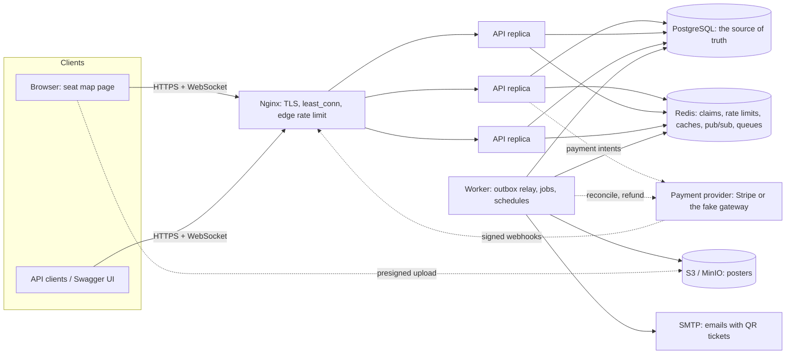
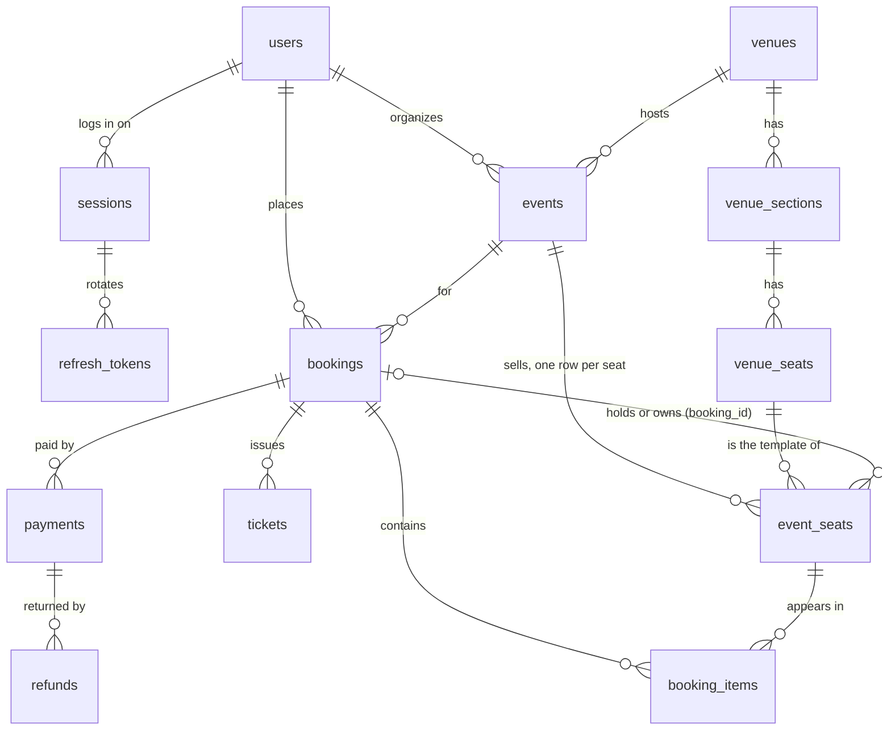
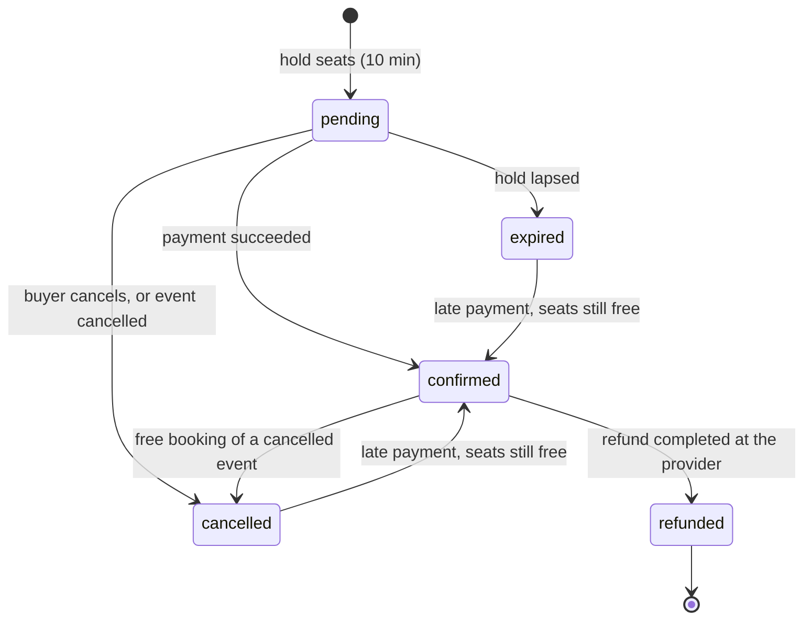
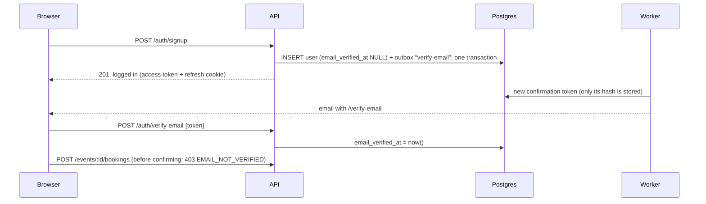
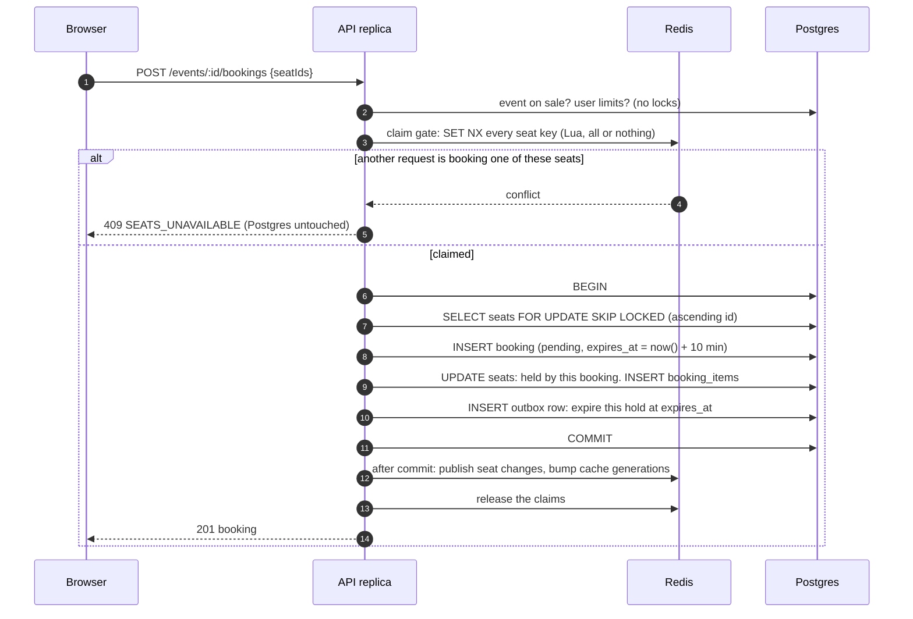
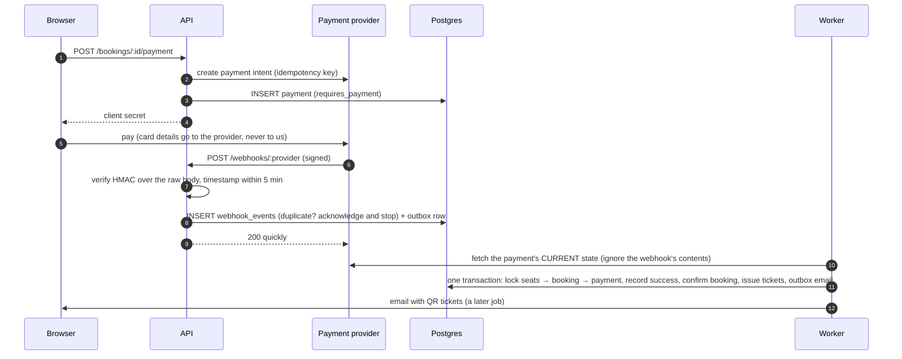
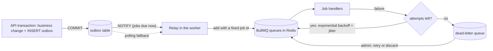
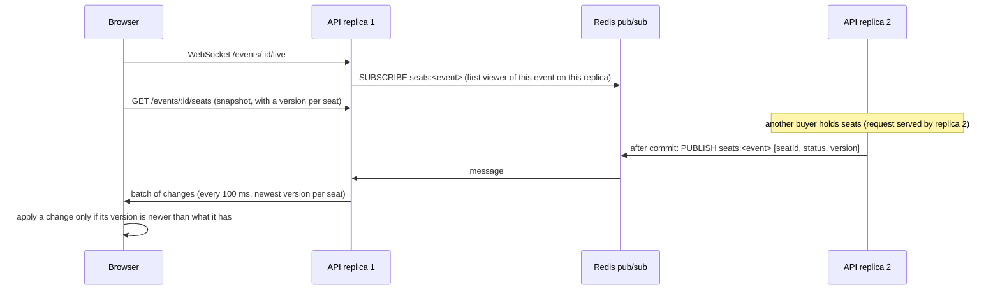
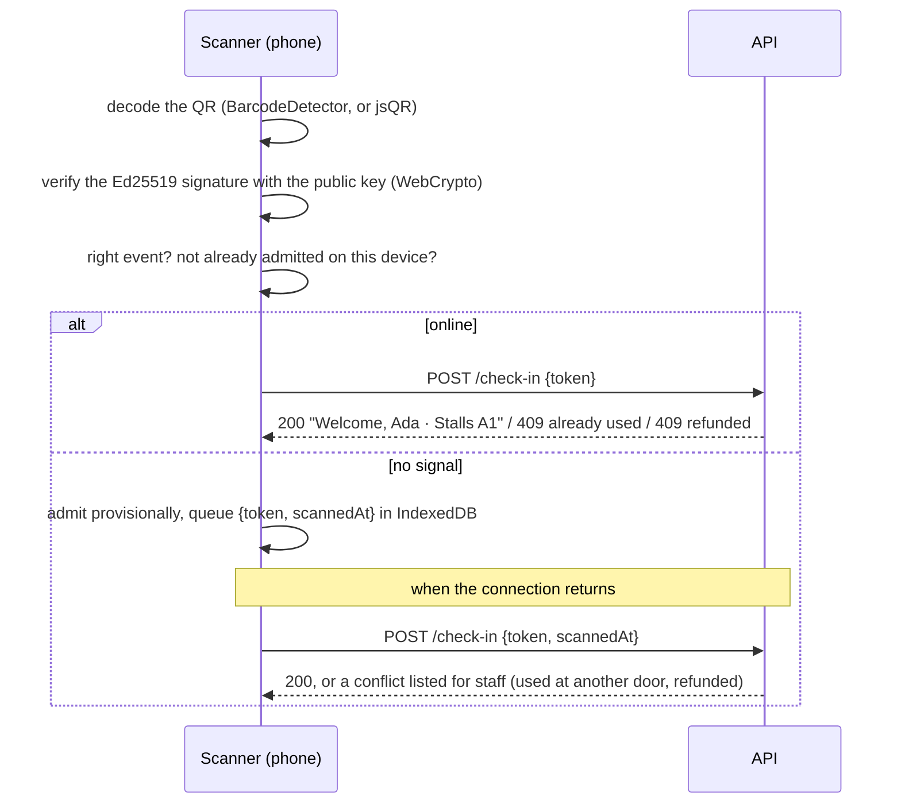

# Architecture

How the pieces fit together, and why. Diagrams render on GitHub (Mermaid). For the reasoning behind individual choices see the [decision records](adr/); for a guided way through the code, the [study guide](STUDY-GUIDE.md).

## The system



One codebase, one Docker image, three commands:

| Process | Command                          | Owns                                                                                                         |
| ------- | -------------------------------- | ------------------------------------------------------------------------------------------------------------ |
| API     | `node dist/server.js`            | HTTP and WebSockets. Stateless, so run as many as you like (3 here).                                         |
| Worker  | `node dist/worker.js`            | Everything slow, retried or scheduled: emails, poster resizing, webhook processing, refunds, expiring holds. |
| Migrate | `node dist/db/migrate.js latest` | Schema changes. Runs once before a release starts.                                                           |

**Postgres decides; Redis accelerates.** Every fact that matters (who owns a seat, what was paid, which ticket is valid) is a row in Postgres, changed only inside transactions and protected by constraints. Redis holds things that are either rebuildable (caches), advisory (the claim gate), or deliberately ephemeral (rate-limit buckets, pub/sub messages). The one exception is BullMQ's queues, and even those are fed from a Postgres outbox, so a Redis wipe loses no committed work.

## Anatomy of a request

What happens to `POST /api/v1/events/:id/bookings`, in order:

| Step | Where                             | What                                                                                                                                                                                  |
| ---- | --------------------------------- | ------------------------------------------------------------------------------------------------------------------------------------------------------------------------------------- |
| 1    | Nginx                             | Terminates TLS, applies the edge rate limit, generates `X-Request-Id`, picks the replica with the fewest active connections.                                                          |
| 2    | `src/app.ts` (`genReqId`)         | Adopts a well-formed `X-Request-Id` (otherwise a UUID). Every log line of this request carries it.                                                                                    |
| 3    | `onRequest` hooks                 | Starts the in-flight gauge; opens the request context (`AsyncLocalStorage`) so deeper code can read the request id; enforces the per-IP token bucket (Redis, shared by all replicas). |
| 4    | `src/modules/auth/guard.ts`       | Verifies the access token (HS256, algorithm pinned), checks the session isn't revoked (Redis denylist), and adds `userId` to the request logger.                                      |
| 5    | Zod schema on the route           | Validates params and body; a bad request never reaches the handler (400 with per-field details).                                                                                      |
| 6    | `src/modules/bookings/routes.ts`  | Per-user rate limit on holds, the confirmed-email check (tickets are emailed), and `Idempotency-Key` handling (a retried request replays the stored response).                        |
| 7    | `src/modules/bookings/service.ts` | The business logic: see [Holding seats](#holding-seats).                                                                                                                              |
| 8    | Kysely + `pg` pool                | One pooled connection per transaction. If none frees up within the timeout, the request fails fast with 503 + `Retry-After` instead of piling up.                                     |
| 9    | Serialization                     | The response schema decides which fields leave the server (a password hash can't leak by accident).                                                                                   |
| 10   | `onResponse` / `onSend`           | Records `http_request_duration_seconds{route}` (the route template, not the raw URL), sets `x-request-id` and `x-served-by`.                                                          |

Errors anywhere become one shape, `{ "error": { "code", "message", "details?" } }`, in `src/lib/errors.ts`. Postgres errors map to meaningful statuses there too: unique violation → 409, deadlock or serialization failure (after retries) → 503 `TRANSIENT_CONFLICT`, pool timeout → 503 `SERVICE_BUSY`.

## The data model



Not drawn: `password_reset_tokens`, `notifications` (the sent-email log), `outbox`, `webhook_events`, `idempotency_keys`.

**Times and time zones.** Event times are stored as UTC instants (`timestamptz`). Each venue has an IANA time zone, and pages and emails show times in it, so a 7:30 PM show in Toronto reads 7:30 PM for every viewer, like a printed ticket. Converting the other way, Postgres does it: `'2026-10-05 19:30'::timestamp AT TIME ZONE 'America/Toronto'` is the instant the seed stores.

**Venue layout vs event inventory.** `venue_seats` is the physical template, written once. `event_seats` is one row per sellable seat _per event_, with its own price, status and version. All booking traffic touches `event_seats`, never the template.

The database enforces the rules itself, so no code path (or future bug) can break them:

| Rule                                                       | Enforced by                                                                     |
| ---------------------------------------------------------- | ------------------------------------------------------------------------------- |
| No two events overlap at a venue                           | `EXCLUDE USING gist (venue_id WITH =, tstzrange(starts_at, ends_at) WITH &&)`   |
| A seat is `available` exactly when no booking points at it | `CHECK` on `event_seats`                                                        |
| One active hold per user per event                         | partial unique index on `bookings (user_id, event_id) WHERE status = 'pending'` |
| One valid ticket per seat                                  | partial unique index on `tickets (event_seat_id) WHERE status = 'valid'`        |
| A webhook event is processed once                          | primary key `webhook_events (provider, event_id)`                               |
| At most one live refund per payment                        | partial unique index on `refunds`                                               |

The remaining rules span several tables (for example "a succeeded payment either confirmed its booking or was refunded"). `src/lib/invariants.ts` checks them after tests and load tests, and on demand in production (`GET /api/v1/admin/invariants`).

## A booking's life



A late payment whose seats were sold to someone else leaves the booking as it is: the payment is recorded and **refunded automatically**, and the buyer gets an email saying so.

## Accounts and email confirmation

Tickets are emailed to the address the buyer logs in with, so booking requires a confirmed address ([ADR 0011](adr/0011-email-verification.md)):



The pages (the catalog at `/`, `/events/:id`, `/my-tickets`, and `/login`, `/signup`, `/forgot-password`, `/reset-password`, `/verify-email`) share `public/session.js` and `public/header.js`: the access token lives in memory only, the httpOnly refresh cookie renews it, and `?next=` brings the visitor back where they were (same-site paths only, so it can't be abused as an open redirect).

## Holding seats



- **The claim gate is a load shield, not a lock.** When 200 buyers click the same seat, 199 are turned away by Redis in about 0.1 ms without taking a database connection. Correctness still comes from the transaction: a TTL lock in Redis can expire mid-work or vanish in a failover.
- **`SKIP LOCKED`** makes losers fail fast (409) instead of queueing behind the winner's lock, which keeps connections free during a rush.
- **Lazy expiry.** A seat held by a lapsed booking counts as free the moment `expires_at` passes, judged by the database clock (`acquirableSql`). The expiry job only tidies up and notifies live clients; correctness never waits for it.
- **Lock order** is the same everywhere: seat rows (ascending id), then the booking, then the payment. No cycles, so no deadlocks between holding, paying, cancelling and expiring.
- **Best available** (`POST /events/:id/bookings/best`, `src/modules/bookings/best-seats.ts`) is a pure ranking over the seat grid: runs of adjacent free seats in each row; front section first; within a section, never strand a lone empty seat; then the row nearest the stage and the middle of the row. The chosen block goes through the same hold. If a competing buyer wins it, the next attempt re-reads the seats and skips that block, up to four times.
- Four strategies are implemented (`naive`, `optimistic`, `serializable`, `pessimistic`) so they can be compared: `npm run race`. See [ADR 0003](adr/0003-seat-locking.md).

## Paying



Webhooks arrive at least once and in any order, so the worker never trusts an event's contents: it re-reads the provider's current state and acts on that, which makes processing idempotent and order-independent. If the booking can no longer be confirmed (the hold lapsed and the seats were sold, the event was cancelled, the booking was already paid), the same transaction records the payment and creates a refund. See [ADR 0005](adr/0005-payments-reconcile.md).

## Jobs and the outbox



Enqueueing straight to Redis from a request can't be atomic with the database: a crash between the two either sends an email for a booking that rolled back, or loses the email for one that committed. The outbox row commits (or rolls back) with the business change, the relay publishes it with a fixed job id (re-publishing after a crash is a no-op), and handlers are idempotent (`notifications` records each email so it's sent once). See [ADR 0004](adr/0004-transactional-outbox.md).

| Queue         | Jobs                                                                             | Concurrency |
| ------------- | -------------------------------------------------------------------------------- | ----------- |
| `email`       | booking-confirmed (QR tickets), password-reset, event-reminder, refund-processed | 10          |
| `payments`    | process-webhook, refund, refund-event                                            | 10          |
| `bookings`    | expire-booking (delayed to the deadline), sweep-expired-holds (every 30 s)       | 20          |
| `media`       | process-poster (sharp: WebP in three sizes)                                      | 2           |
| `maintenance` | send-event-reminders (every 15 min), cleanup (daily, 03:00 UTC)                  | 1           |

Email leaves through [Resend](https://resend.com)'s API in production (Mailpit over SMTP locally, in memory in tests: `MAIL_TRANSPORT`). Ticket, reminder and refund emails carry an idempotency key (`booking-confirmed/<booking id>`), so even a crash between "Resend accepted it" and "we recorded it" can't send them twice. The email queue is paced to Resend's rate limit (2/s) across all workers. See [ADR 0012](adr/0012-resend.md).

## Live seat maps



- **Subscribe first, then load the snapshot**, and apply updates by version: no change is missed in between, and none is applied twice or out of order.
- **Publish after commit only**, so viewers never see a seat change that rolled back.
- **Per replica, per event**: each replica subscribes only to the events its own viewers watch, and fans out to them.
- **Slow clients are dropped** once 1 MiB is buffered for them, so one bad connection can't exhaust memory. Heartbeats every 30 s find dead connections; each replica caps connections at 20,000.
- On shutdown, sockets close with code 1001 (going away); the page reconnects with exponential backoff and jitter, so a whole audience doesn't reconnect in the same instant.

### Who's watching: "1,240 viewing now" and "Trending now"

A viewer is an open live seat-map socket, and each replica knows only its own ([ADR 0013](adr/0013-viewer-counts.md), `src/realtime/viewers.ts`):

```
every 5 s, each replica:   HSETEX viewers:<event> PX 15000 FIELDS 1 <replica> <its count>
                           ZADD live-events <now> <event>
an event's viewers:        sum of HVALS viewers:<event>
trending:                  events in live-events touched in the last 15 s, summed, sorted
```

- Each hash field expires on its own, so a crashed replica's count disappears within 15 s with nobody cleaning up; a draining replica deletes its fields at once. Redis work grows with the number of events watched, not with how fast people come and go.
- After each report the hub reads its events' totals and sends `{type:'viewers', count}` when one changed; a newcomer gets the last count right after `hello`.
- "Sold in the last hour" is counted in Postgres from confirmed bookings (partial index on `(event_id, confirmed_at)`), and the page adds each seat it sees turn sold, so it moves the instant a sale lands.
- Both numbers are best effort: without Redis, `viewers` is `null` and trending is empty, and pages work as before.

## Tickets on the phone: offline, and in the calendar

The door is where the signal is worst, so tickets have to open without one ([ADR 0014](adr/0014-offline-tickets.md)). Two stores, kept strictly apart:

| Store                                                | Holds                                            | Cleared                                                   |
| ---------------------------------------------------- | ------------------------------------------------ | --------------------------------------------------------- |
| Service worker cache (`public/sw.js`, Cache Storage) | public files only: pages, scripts, styles, icons | old versions on each release                              |
| Saved tickets (`public/offline-store.js`, IndexedDB) | the signed-in user's bookings and QR codes       | on logout, on login, and when the server ends the session |

- **Network first.** Online, every page comes fresh from the server, so a release is live on the next load; offline (or after 4 s on a bad connection) the service worker serves the last saved copy. API requests bypass its cache entirely: personal data there would outlive the login and show up for the next person using the browser.
- **Saving tickets.** My tickets saves the upcoming ones (confirmed, event not over yet) every time it loads, and the event page does the same right after a purchase. Offline, `session.offline` tells "can't reach the server" apart from "logged out": the page shows the saved copy under a banner (and the header says "Offline" rather than "Log in"), then reloads the live version when the connection returns.
- **Why a saved QR code is enough.** It's a signed token, so a copy is as good as the original. Whether it was already used or refunded is checked by the scanner at the door, never by the picture.
- **Calendar.** `GET /bookings/:id/calendar.ics` and the ticket email's attachment are the same RFC 5545 file (`src/lib/ical.ts`): UTC times, CRLF lines folded at 75 bytes, escaped text, a reminder 2 hours before. The UID is fixed per booking, so adding it twice updates one entry instead of duplicating it. My tickets also offers a Google Calendar link, built in the browser.

## At the door: the scanner

`/scan` (`public/scan.js`) turns an organizer's phone into a ticket scanner that keeps working when the venue's signal doesn't ([ADR 0015](adr/0015-offline-door-scanning.md)).



- **The signature does the offline work.** A ticket is `payload.signature`, Ed25519-signed by the server. The scanner holds only the public key (`GET /tickets/public-key`, kept on the device), so it can reject forgeries and tickets for other events without the server, and nothing on the phone can mint tickets.
- **The database still decides admission.** Online, `POST /check-in` admits a ticket with one conditional `UPDATE`, so two doors scanning the same code at the same instant admit it once. Offline, a device catches repeats of the tickets it admitted itself; a ticket shown at two offline doors is admitted twice, and the second sync reports it. That's the trade-off for letting people in when the network is down.
- **Real scan times.** Queued check-ins carry `scannedAt` (accepted up to 24 hours back, never in the future), so attendance shows when people actually came in, not when the phone found a signal.
- **Attendance by polling.** `GET /events/:id/attendance` (sold, checked in, the last 10 scans) is polled every 3 s by each scanner. A handful of organizer screens don't justify authenticated WebSockets; a 1 s micro-cache and ETags keep polling cheap, and the partial index `tickets (event_id, checked_in_at DESC)` serves the latest scans. Each scanner shows its own check-ins at once, without waiting for the next poll.
- **Camera fallbacks.** Cameras need HTTPS. Without one (or a camera), staff can upload a photo or type the code. jsQR is served from `public/vendor/` because the CSP allows our own scripts only.

## The organizer's side

`/organizer` lists an organizer's events with their numbers; `/organizer/events/new` creates one step by step; `/organizer/events/:id` is its dashboard (`src/modules/organizer/`, `public/organizer*.js`).

- **Revenue is money kept: payments charged minus refunds paid out**, not "confirmed bookings × price". Counting payments gets the awkward cases right with no special handling: a duplicate charge that was refunded nets to zero, and so does a late payment for seats that were already gone. (It's the same rule `npm run check:invariants` audits: no money kept for nothing.)
- **Every number is one grouped query** over an index that already exists: seats per event, bookings by `(event_id, status)`, check-ins by event, and sales over time from the partial index `bookings (event_id, confirmed_at) WHERE status = 'confirmed'`. Sales are bucketed with `date_bin` (5 minutes) or `date_trunc(…, venue time zone)` (hours, days), so "Tuesday" is Tuesday where the show is. Each bucket size looks back a bounded window, so a chart never has thousands of bars.
- **Attendees** are one row per valid ticket (a refunded ticket isn't an attendee), keyset-paged on `(name, ticket id)`. The CSV export streams them 1,000 at a time, and escapes cells for spreadsheets: a value starting with `= + - @` gets a leading apostrophe, because buyers type their own names and `=HYPERLINK(…)` would otherwise run as a formula on the organizer's machine (CSV injection).
- **Times are typed in the venue's zone.** "7:30 PM" in the wizard means 7:30 PM on the venue's clocks, wherever the organizer sits. Browsers only convert to their own zone, so `zonedTimeToUtc` in `public/format.js` does it with `Intl` (read the time as UTC, see what the venue's clocks show then, correct, and repeat once for days when the clocks change).
- **Posters go straight to object storage.** The wizard asks for a presigned POST, the browser uploads the file to MinIO/S3 directly (the CSP's `connect-src` allows that one origin), and a worker resizes it. The API never handles the file's bytes.
- The dashboard's seat map is the buyers' map (`public/seat-grid.js`, shared with the event page), fed by the same WebSocket, so the organizer watches seats go into carts and sell in real time.

## Caching

| Data                                                     | Layer                                                                                                    | Invalidation                                                                                                                               |
| -------------------------------------------------------- | -------------------------------------------------------------------------------------------------------- | ------------------------------------------------------------------------------------------------------------------------------------------ |
| Seat maps, availability counts (hot, change constantly)  | In-process micro-cache, 1 s TTL, single-flight: a thousand concurrent misses cost one query. ETag → 304. | None; 1 s staleness is fine because the WebSocket keeps clients current.                                                                   |
| Live numbers (viewers, sold in the last hour), trending  | The same micro-cache, 1 s                                                                                | None; the underlying counts only move every few seconds.                                                                                   |
| Event pages, public listings (read a lot, change rarely) | Redis read-through, keyed by **generation counters**                                                     | Every write bumps the generation after commit. A slow reader can only store stale data under an old generation that nobody reads any more. |

## When things fail

| Failure                                | What happens                                                                                                                                                                                                                                                                                                                                |
| -------------------------------------- | ------------------------------------------------------------------------------------------------------------------------------------------------------------------------------------------------------------------------------------------------------------------------------------------------------------------------------------------- |
| An API replica crashes                 | Nginx retries requests that never reached it on another replica; its WebSocket viewers reconnect elsewhere. Nothing is lost: no state lives in a replica.                                                                                                                                                                                   |
| Deploying a new release                | `deploy/rollout.sh` starts new replicas, moves Nginx to them, then drains the old ones: 0 failed requests under load ([DEPLOY.md](DEPLOY.md#why-a-rollout-script)).                                                                                                                                                                         |
| Database connections exhausted         | Requests wait up to 5 s for a connection, then get 503 + `Retry-After`. Nginx doesn't count those as failures, so overload never turns into "no live upstreams".                                                                                                                                                                            |
| Redis down                             | Claim gate, caches, rate limits and the session denylist fail open: requests keep working and Postgres still guarantees correctness (the cost: a just-revoked access token keeps working until it expires, at most 15 minutes). Live updates, viewer counts and job processing stop until Redis returns; committed jobs wait in the outbox. |
| Worker down                            | Requests still succeed. Outbox rows accumulate (`outbox_unpublished` alerts on age) and are published when a worker returns. Lapsed holds are still free to take (lazy expiry).                                                                                                                                                             |
| Webhook lost or delayed                | The provider retries. Two delivered at once, or out of order: deduplication plus reconciliation converge on the provider's state.                                                                                                                                                                                                           |
| A job keeps failing                    | 5 attempts with backoff, then the dead-letter queue for an admin.                                                                                                                                                                                                                                                                           |
| Email provider trouble                 | Rate limits and outages: retried with backoff (the queue is also paced to the limit). A bad API key, an unverified domain or a used-up quota: dead-lettered at once with the provider's message, then retried by an admin once fixed. No email is lost.                                                                                     |
| Payment succeeds after the hold lapsed | Seats still free: the booking is confirmed anyway. Seats sold: automatic refund and an email.                                                                                                                                                                                                                                               |

## Observability

- **Logs:** one JSON line per event (pino), with ISO time, level, `instance`, and the `requestId`. The worker logs a job's originating `requestId`, carried through the outbox row, so one id connects the Nginx access log, the API log and the jobs it caused. Secrets (tokens, passwords, cookies) are redacted.
- **Metrics** (Prometheus, `/metrics` on each API replica and on the worker's port 3100): request latency by route, in-flight requests, database pool usage and waiters, cache hits and misses, hold outcomes by strategy, job durations by outcome, queue depths, outbox backlog and age, WebSocket connections, plus Node's own (event-loop lag, heap, GC). A Grafana dashboard is provisioned (`deploy/monitoring/`).
- **Health:** `/health/live` (the process answers; no dependency checks, so a database outage doesn't trigger restart loops) and `/health/ready` (database and Redis reachable, and not shutting down). Docker's health check uses readiness.

## Source map

```
src/
  server.ts, worker.ts        process entry points, graceful shutdown
  app.ts                      Fastify: request ids, hooks, plugins, routes
  config.ts                   environment, validated at boot (and production guards)
  db/                         pool, Kysely, transactions (retry + after-commit), migrations
  lib/                        errors, logging, metrics, caching, rate limiting, idempotency,
                              invariants, storage, mail, lifecycle
  modules/<area>/             routes + service per area: auth, users, venues, events,
                              bookings, payments, tickets, admin, health
  jobs/                       queues, the outbox relay, the job runner, handlers, schedules
  realtime/                   live seat-map hub (WebSockets + Redis pub/sub), viewer counts
  fake-gateway/               a Stripe-shaped payment provider for offline development
public/                       the website (catalog, event page, My tickets, account pages), with
                              the service worker and manifest that make it an installable app
scripts/                      seed, race test, load tests, e2e test, invariant check, cluster
deploy/                       Nginx, monitoring, production compose, rollout
test/unit, test/api           Vitest: unit and HTTP-level integration tests
```
